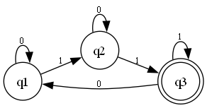

# Deterministic finite automaton 🔍

## Description
Implementation of a **deterministic automaton**.
The automaton moves between states according to the labels defined in the transitions.
Its objective is to evaluate whether the string is accepted or not.

## Algorithm
The algorithm goes through the input string character by character, and goes through the respective labels of the graph.
The automaton starts in an initial state and, upon finishing reading the string, verifies whether an acceptance state has been reached.

## Example

### Input
Enter the states separated by a space: q1 q2 q3

Enter the alphabet (separate each item with a space): 0 1

Enter the transitions row by row ("-" for empty):
 
  0    1    
q1: q1 q2

q2: q2 q3

q3: q1 q3

Enter the initial state: q1

Enter the ACCEPTING states separated by a space:q3

Enter the string to validate (Separate each transition with spaces. E.g.: 0 1 1 1): 0 1 1 0 1 1

### Automaton Image

### Output
**Accepted string**

Explanation: Since the initial state is q1, the string reaches the accepting state q3.

---

# Autómata Finito Determinista🔍

## Description
Implementación de un  **autómata determinista**.
El autómata se mueve entre estados de acuerdo con las etiquetas definidas en las transiciones. 
Su objetivo es evaluar si la cadena es aceptada o no.

## Algoritmo
El algoritmo recorre la cadena de entrada carácter por carácter y avanza a través de las etiquetas correspondientes en el grafo. 
El autómata comienza en un estado inicial y, al terminar de leer la cadena, verifica si ha llegado a un estado de aceptación.

## Ejemplo

### Entrada
Enter the states separated by a space: q1 q2 q3

Enter the alphabet (separate each item with a space): 0 1

Enter the transitions row by row ("-" for empty):
 
  0    1    
q1: q1 q2

q2: q2 q3

q3: q1 q3

Enter the initial state: q1

Enter the ACCEPTING states separated by a space:q3

Enter the string to validate (Separate each transition with spaces. E.g.: 0 1 1 1): 0 1 1 0 1 1

### Diagrama del autómata

### Salida
**Accepted string**

Explicación: Dado que el estado inicial es q1, la cadena alcanza el estado de aceptación q3
